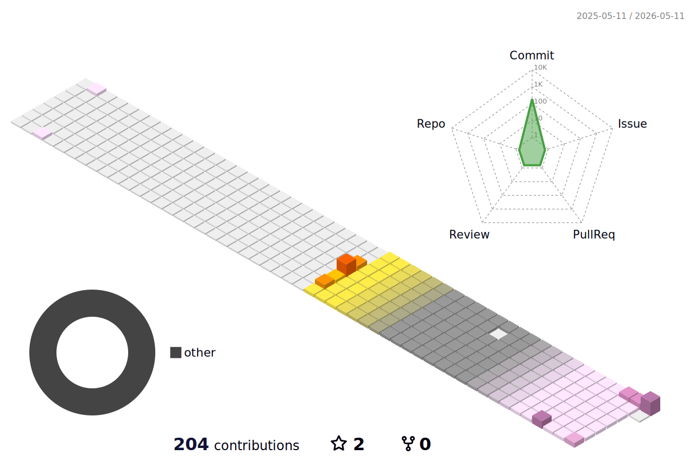

  

### 👋 Hi, I'm Eojin

LLM Developer with hands-on experience across the full AI development lifecycle—from data curation and fine-tuning to production deployment. Currently focused on **AI Safety & Ethics**, building trustworthy AI systems through RAG, red teaming, and responsible AI development.

🌏 Based in Australia | 🎯 Next: Trust & Safety roles in English-speaking environments

### 💼 Experience

- **LLM Developer** @ VRFrame (2025.01 - 2025.07)  
  Azure-based LLM services, multilingual chatbots (LG client), FastAPI deployment

- **Data Manager** @ Selectstar (2024.09 - 2024.11)  
  Red teaming dataset management for Korea's open-source foundation model (10k cases)

- **AI Developer** @ Seoul Digital Foundation (2024.04 - 2025.01)  
  RAG systems, chatbot optimization, supercomputer-powered model training

- **AI Training** @ K-Digital Training (900 hours)  
  Intensive Python, ML, and AI development bootcamp

### 🛠️ Tech Stack

#### 🤖 LLM & AI Development

#### 🛡️ AI Safety & Ethics

#### ☁️ Cloud & API

#### 📊 Data & ML

#### 💻 Tools & Platforms

#### 🎨 Design

---

